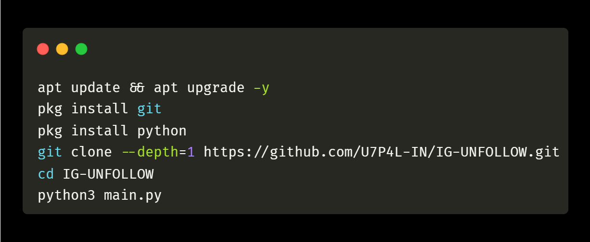
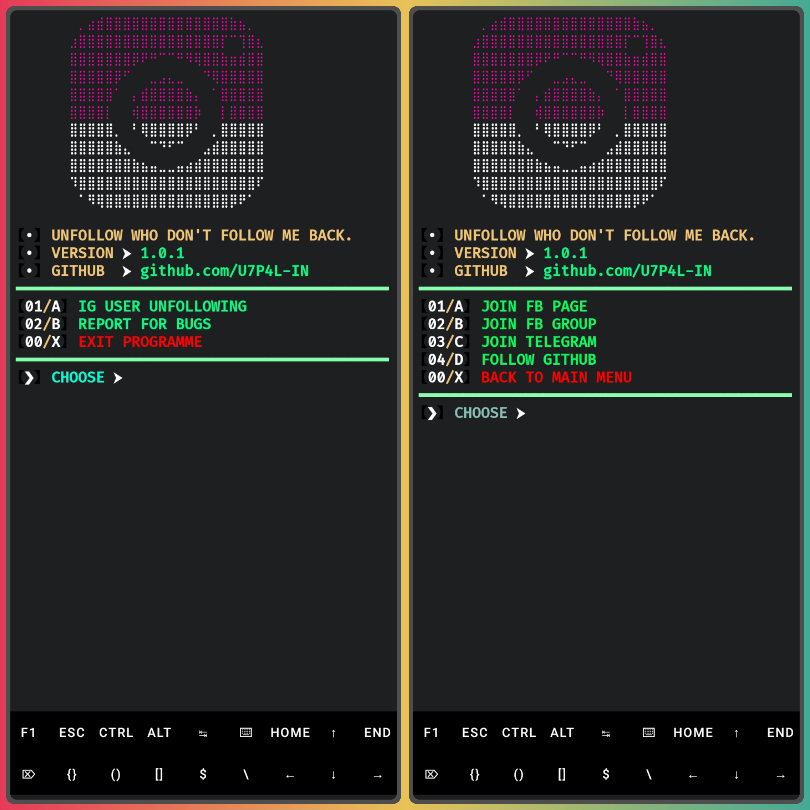
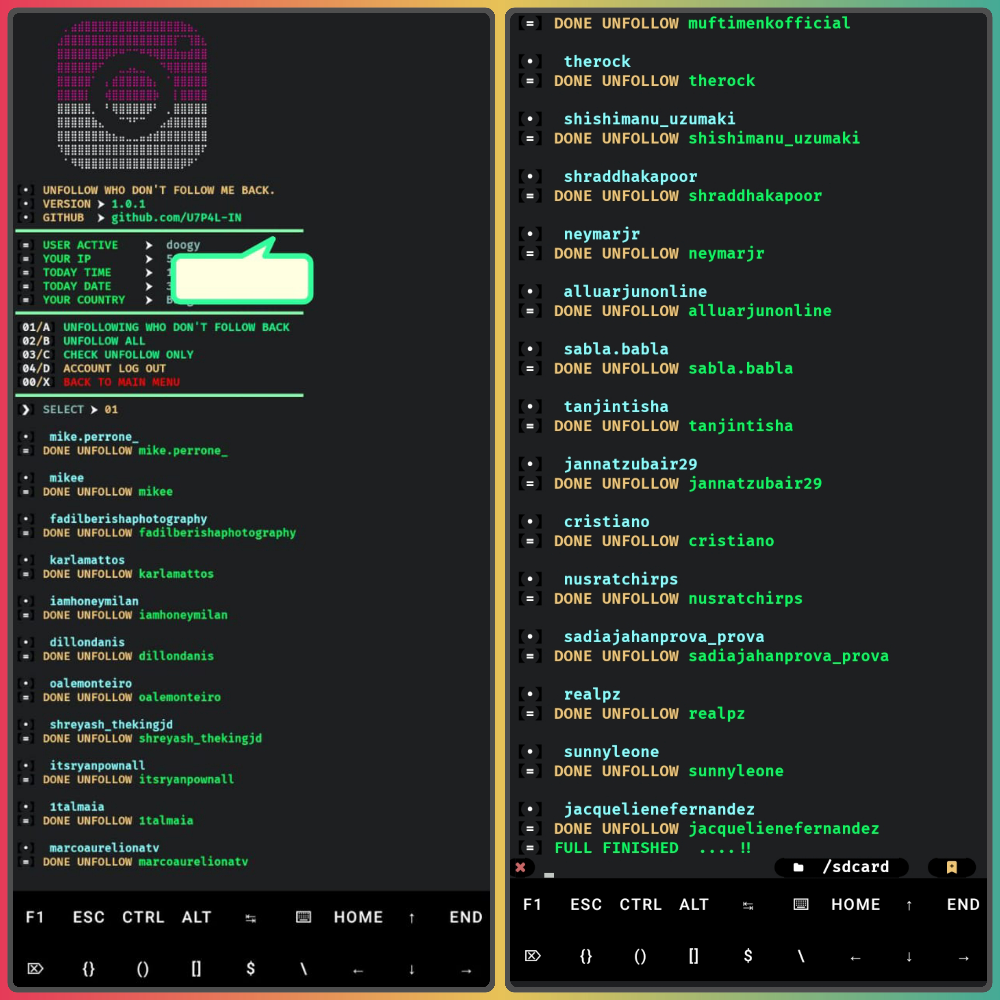
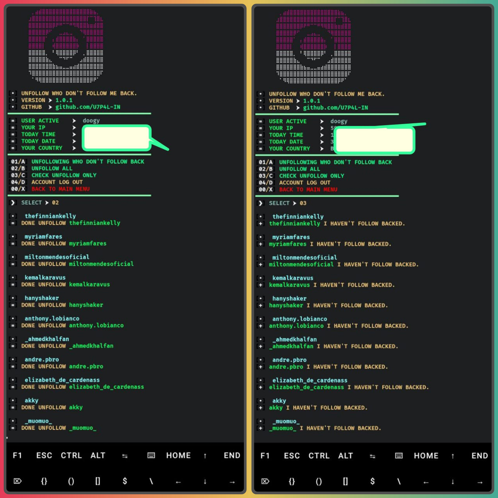
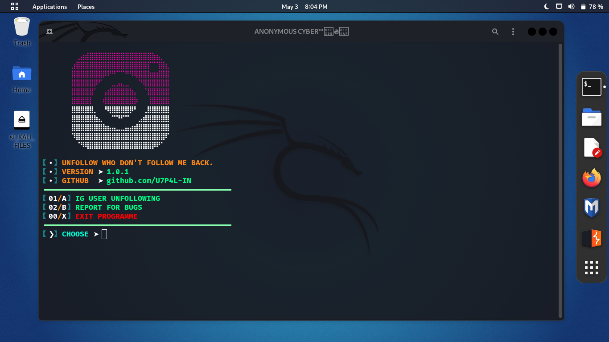
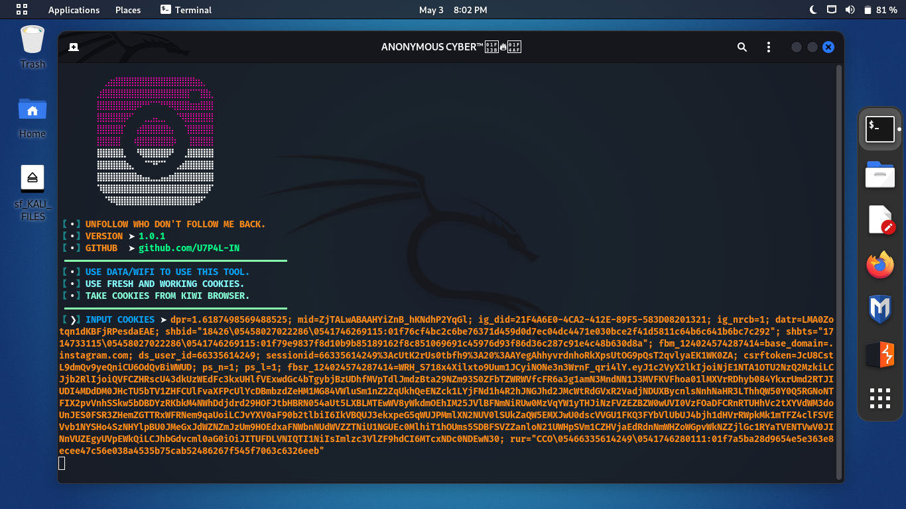
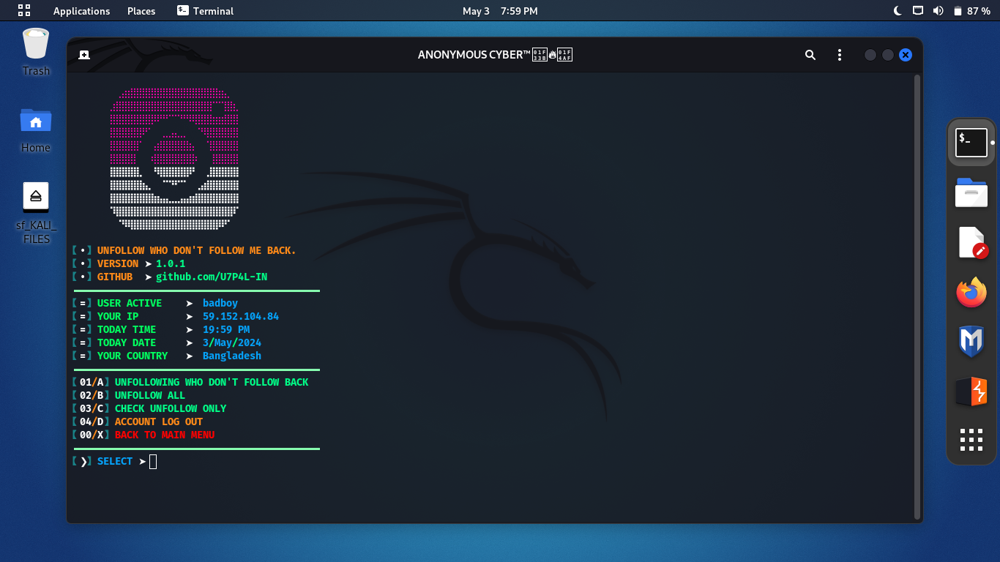
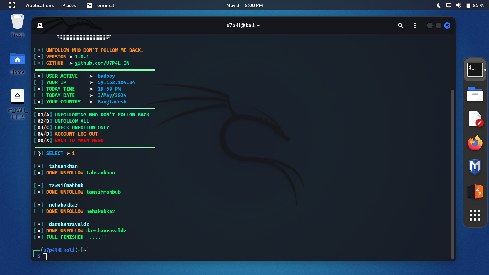

<p align="center">
</p>

</p>
   <p align="center">
      <a href="https://github.com/U7P4L-IN/IG-UNFOLLOW/stargazers">
      </a>
      <a href="https://github.com/U7P4L-IN/IG-UNFOLLOW/releases/latest">
      </a>
      <a href="https://www.conventionalcommits.org/en/v1.0.0/">
      </a>
      <a href="https://github.com/U7P4L-IN/IG-UNFOLLOW/actions/workflows/github-action.yml">
      </a>
   </p>
   
</br>

> This is a simple Python script for automatically unfollowing Instagram users who do not follow you back

## Features
- UnFollow Who Don't Follow Back
- Unfollow All
- Check Only Unfollow

## Requirements - 
- Stable Internet Connection
- Termux Version Upto Date
- Android 7 or higher
- No Root
- No Termux Knowlegde

<h4 align="left">TESTED ON > </h4>

* Kali Linux
* Termux
* Mac os
* Ubuntu
* Perrot Sec OS

## Prerequisites
1. Python 3.x installed on your system.

## Usage

1. Clone or download this repository to your local machine.
2. Open the terminal and navigate to the downloaded directory.
3. Install the required dependencies using the following command: 
```shell
 pip install requests
```

<h4 align="left">INSTALL TOOL ON TERMUX > </h4>
 
```bash
apt update && apt upgrade -y
pkg install git
pkg install python
git clone --depth=1 https://github.com/U7P4L-IN/IG-UNFOLLOW.git
cd IG-UNFOLLOW
python3 main.py
```
- **Running on Termux**  
 ```bash
cd IG-UNFOLLOW
git pull
python main.py
 ```
<p align="center">

<h5 align="center"><b>TERMUX</b></h5>

## Menu >
<p align="center">

## Cookie log in and Feature >
<p align="center";>

### Unfollow Who Don't Follow Back >
<p align="center";> 

### Unfollow All And Check Unfollow Only Result >
<p align="center";> 

- The script will start unfollowing users who do not follow you back on Instagram. Please be patient as it might take some time depending on the number of users being unfollowed.

# Report bugs
If you notice issues while installing this tool or running this tool kindly mail to me at <a href="mailto: lisame0007@gmail.com">Gmail</a> or Open an issue via github.

### Requirements 
```
python-3
pip
Internet Connection
And some other python packages
``` 
[Python 3](https://www.python.org/downloads/)

<hr>

<h3 align="left">Install Requirements (on Linux) > </h3><br>

```bash
>> apt-get install git python3 python3-pip python python-pip
```
<h2 align="left">Kali Linux/Ubuntu/Parrot os > </h2>

```bash
sudo apt-get update && apt-get install git
git clone https://github.com/U7P4L-IN/IG-UNFOLLOW.git
cd IG-UNFOLLOW
ls
sudo python3 main.py
```
<h5 align="center"><b>KALI LINUX</b></h5>

<p align="center">
<p align="center">
<p align="center">
<p align="center">

</br>

<p align="center">  <a href="https://t.me/TheU7p4lArmyX"></a></p>

</br>

### Tools Languages :

<p align="center">

</p>

<br>

### No IG-UNFOLLOWs appearing?

- Doesn't work for cookies or new accounts!
- Maybe your Instagram account is checkpointed or locked.
- The Instagram system has been repaired causing failure to get IG-UNFOLLOWs.

### Why login failed?

- Your Instagram account cookies are no longer valid or expired.
- Your Instagram account is logged out of the browser.
- Maybe your Instagram account has been checkpointed or temporarily locked.


### Contributing
Feel Free To Clone This Project. For Major Changes, Please Open An Issue First To Discuss What You Would Like To Change Or Add, Thank You!!.

<h2 align="center">LICENSE</h2>

**IG-UNFOLLOW** is released under the MIT license, which grants the following permissions:
- Commercial use
- Modification
- Distribution
- Patent use
- Private use

For more convoluted language, see the [LICENSE](/LICENSE).
</br>

<h5 align="center"><b>DESCRIPTION</b></h5>

* ©️ Copyright Message
>> Copyright © [2023-27] [U7P4L-IN]
>All rights reserved. This Python project, along with its code, documentation, and any associated files, is the intellectual property of ANONYMOUS CYBER. You may not reproduce, distribute, or modify the contents of this repository without explicit permission from the owner.
## Give A Star ⭐
> You can also give this repository a star to show more people and they can use this repository.